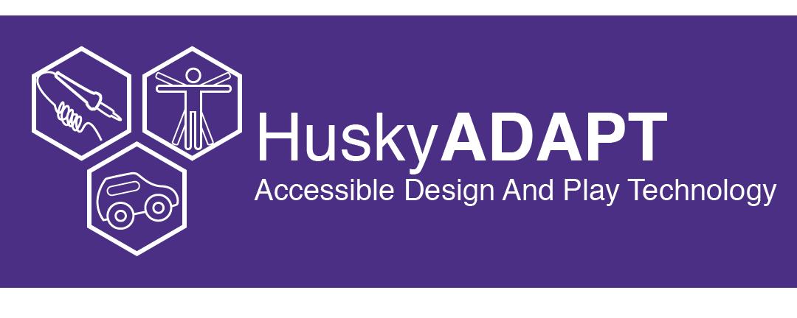
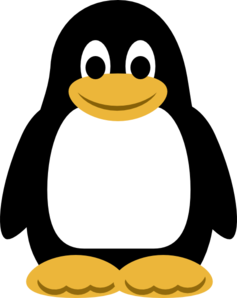

# EasyType
Husky ADAPT EasyType

# Group PROJECT
Husky ADAPT repo: Hello! We areee Sarthak, Ellani, and Jessy: Team EasyType. Our goal this year is to design a one-handed keyboard, specifically for Queso - a smart third grader who is a Minecraft expert. Here we will document our progress and interesting ideas we find along the way. Stay tuned!

Project Pages site HuskyADAPT.github.io/GroupName
you can change what's on the website by either changing the markdown file on master or a /docs folder on master

<h3>
<strong>YAY penguin<strong>
</h3>
## Screenshots

## Authors
Sarthak Turkhia, Ellani Johnson and Jessy Ha
